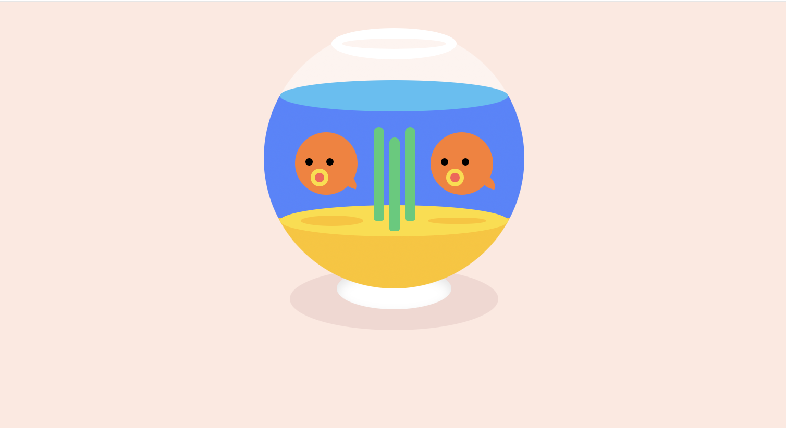
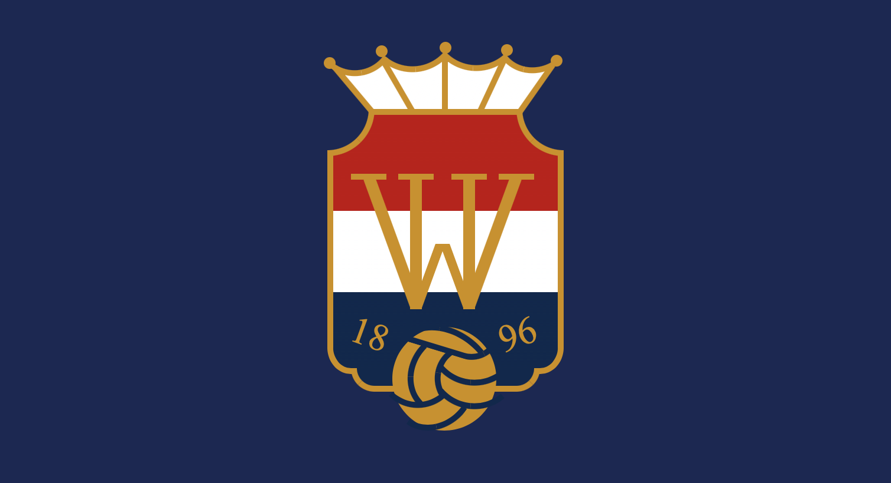

# CSS Art Project

Dit project heb ik gemaakt voor het plezier en om te laten zien dat code niet alleen
bedoeld is voor functionele toepassingen, maar ook creatief kan worden ingezet.
Het doel was om visuele ontwerpen te maken waar je naar kunt kijken zonder dat er
interactie nodig is.

## Preview

<p>
  
  
  
</p>

## Tech stack


## Installatie (Svelte)

```
npm install
npm run dev
```

Ga naar: http://localhost:5173/

## Projectinhoud

Het eindresultaat bestaat uit drie CSS art projecten:

- Platenspeler met draaiende vinylplaat
- Viskom met zwemmende vissen
- Willem II logo

## Gebruikte technieken

- CSS gradients (linear & radial)
- Pseudo-elementen (::before & ::after)
- CSS animaties
- Absolute positioning

## Wat heb ik geleerd

- Creatieve visuals maken met pure CSS
- Efficiënter coderen
- Animaties bouwen zonder JS
- Werken met Svelte componenten

## Reflectie

Tijdens dit project ontdekte ik hoe code ook creatief kan worden ingezet.
Ik merkte dat ik in het begin vaak te veel code schreef voor simpele vormen.
Hierdoor leerde ik slimmer en efficiënter werken.

Door inspiratie uit CSS Battles heb ik geleerd mijn code korter en overzichtelijker
te maken. Dit helpt mij nu om sneller en beter te werken.

In een volgend project wil ik eerder nadenken over efficiënte oplossingen en
nog creatievere visuals maken met code.

## Auteur

Ouassila  
Student ICT  
Fontys Hogescholen  
Semester 4
